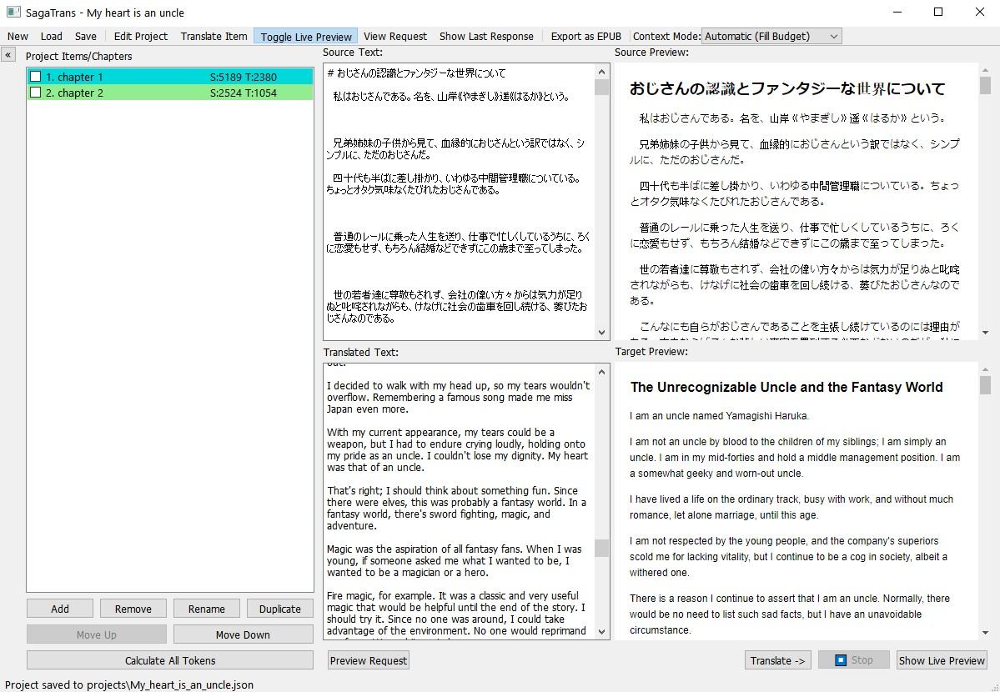

# SagaTrans
The application contains many errors, please keep this in mind.


A graphical application specifically designed for translating chapters from books, web novels, light novels, and similar texts. It manages and performs AI-powered translations with project-based organization, token management, and markdown preview.

## Features

- **Project Management:** Create, edit, rename, reorder, and remove multiple translation projects.
- **Token Counting:** Uses `tiktoken` to optimize context size for API calls.
- **Streaming Translations:** Integrates with OpenRouter API, OpenAI compatible APIs, and Ollama API for real-time translation streaming.
- **Markdown Preview:** View formatted source and translated text with live markdown rendering using `QWebEngineView`.
- **Persistent Storage:** Save and load projects as JSON files.
- **Modern UI:** Built with PyQt5 for a modern graphical interface.

## Development Approach

This entire application was vibe-coded using AI, optimized for context-aware translation and system prompt style suggestions. The development process leveraged AI assistance to create an intuitive and efficient translation workflow.

## Installation

### Prerequisites

- Python 3.8 or higher

### Install dependencies

```bash
pip install -r requirements.txt
```

### Dependencies

- `PyQt5`
- `tiktoken`
- `requests`
- `markdown2`
- `pyperclip`
- `ebooklib`
- `PyQtWebEngine`

## Usage

Run the application with either of the following scripts:

- On Windows: `start.bat`
- On Linux/Mac: `start.sh`

These scripts will set up a virtual environment and run the application.

- On first launch, enter your API key when prompted.
- Create a new project, add text items, and start translating.
- Use the markdown preview feature to view formatted translations.

For best performance, It is recommended to use Gemini 2.5 Flash or Llama 4 Maverick models.

After launching the application, you can edit configuration files in the `settings/` folder to customize the application behavior.

## Project Structure

- **`src/main.py`** — Main application entry point.
- **`src/data_manager.py`** — Handles saving/loading projects and API keys.
- **`src/openrouter_client.py`** — API communication logic.
- **`src/ui/`** — UI components and dialogs.
- **`projects/`** — Saved project files (JSON format).

## Documentation

For detailed information about the project, please refer to the following documentation:

- [Algorithms Overview](docs/ALGORITHMS.md) - Explanation of core algorithms and internal logic
- [Context Construction Algorithm](docs/CONTEXT_ALGORITHM.md) - In-depth explanation of how context is built for translation prompts
- [Prompt System Guide](docs/PROMPT_GUIDE.md) - Guide to the prompt system and configuration

## Configuration

Configuration files are stored in the `settings/` folder:

- `config.json` - General application configuration including API keys
- `models.json` - Model configurations for different providers

These files are automatically created on first launch with default values. You can edit them to customize the application behavior.

## License

This project is licensed under the MIT License - see the [LICENSE](LICENSE) file for details.

## Acknowledgments

- [OpenRouter API](https://openrouter.ai/)
- [OpenAI](https://openai.com/)
- [Ollama](https://ollama.ai/)
- [`tiktoken`](https://github.com/openai/tiktoken)
- [`markdown2`](https://github.com/trentm/python-markdown2)
