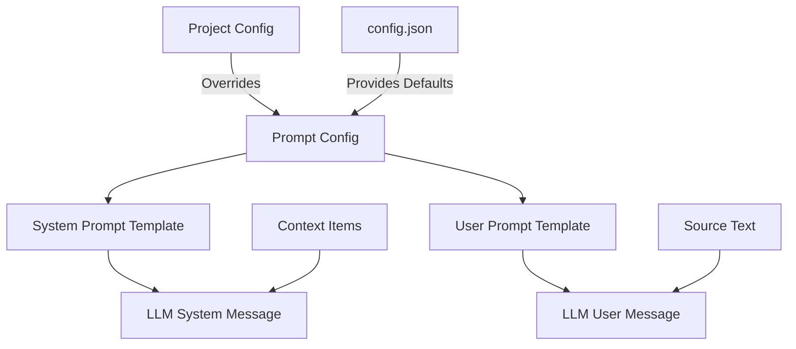

# Prompt System Guide

## Full Structure Overview



## Complete Request Example

```json
{
  "model": "google/gemini-2.0-flash-exp:free"
  "messages": [
    {
      "role": "system"
      "content": "You are a translation assistant...\n[CONTEXT ITEMS HERE]\nIMPORTANT: Respond with *only* the translation..."
    }
    {
      "role": "user"
      "content": "Translate this text to Polish:\nHello world"
    }
  ]
  "stream": true
}
```

## Component Breakdown

### 1. System Message
- **Role**: Defines LLM behavior
- **Components**:
  - **Pre-context instructions:** General instructions for the AI (e.g. role target language).
  - **Context items section:** Includes the dynamically built context from other items.
  - **Post-context instructions:** Strict formatting rules or final instructions (e.g. respond with only the translation).
- **Template Variables**:
  - `{target_language}`
  - `{context_items}`

### 2. User Message
- **Role**: Contains translation request
- **Components**:
  - Direct instruction
  - Source text
- **Template Variables**:
  - `{target_language}`
  - `{source_text}`

### 3. Context Items
- **Format**:
```python
"""
==== CONTEXT ITEM START: {name} ====
Source: {source_text}
Translation: {translated_text}
==== CONTEXT ITEM END: {name} ====
"""
```

## Example Scenarios

1. **Basic Translation**:
   - System: Default template
   - User: "Translate this to French:\nHello world"

2. **Styled Translation**:
   - System: "Translate formally to German..."
   - User: "Please translate professionally:\n{source_text}"

3. **Context-Heavy**:
   - System: Includes 5+ context items
   - User: Standard template

## Configuration Storage

Prompt settings can be defined in two places:

1.  **`config.json`:** Provides default prompt templates under the `"default_prompts"` key.
    ```json
    {
      "default_prompts": {
        "pre_system_prompt": "Default pre-context system prompt..."
        "post_system_prompt": "Default post-context system prompt..."
        "user_prompt": "Default user prompt template..."
      }
    }
    ```
2.  **Project File:** Each project's JSON file can contain a `"prompt_config"` key. Settings defined here will **override** the defaults from `config.json` for that specific project.
    ```json
    {
      "title": "My Project"
      "prompt_config": {
        "pre_system_prompt": "Custom instructions for this project..."
        "user_prompt": "Translate to {lang}:\n{text}"
        // post_system_prompt is not overridden so the default from config.json will be used
      }
      // ... other project data
    }
    ```

When building the API payload the application first loads defaults from `config.json` and then applies any overrides from the current project's `prompt_config`. Only prompt keys with non-empty values that differ from the loaded defaults are saved in the project file to avoid unnecessary clutter.

## Best Practices
1. Maintain clear instruction hierarchy
2. Use consistent context item formatting
3. Test prompt variations thoroughly
4. Document custom templates